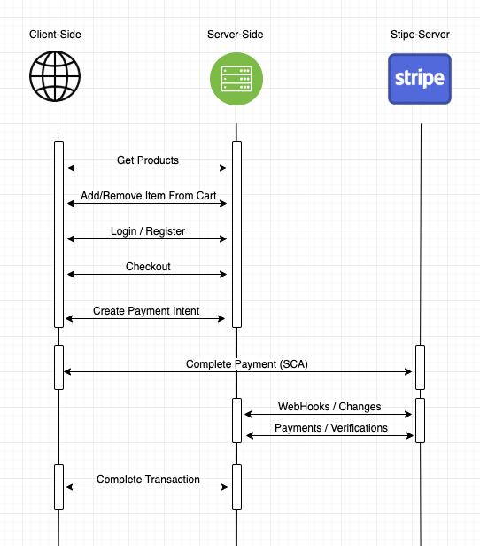

# Stripe Ecommerce Demo

## How to setup

First you need to install Stripe CLI  
You can see how you can install it from this link 
[ Stripe CLI Install Guide](https://stripe.com/docs/stripe-cli "stripe cli install")
 

Then you need to install node modules by running  
`npm install`  
 
Then you can start the app by running  
`npm run dev`  

## How does it work ?
### Project Framework
* Node.js , Express
### Data Store
* SQLite for persistent data and verifications
* Sessions for cart data
### Home Page
* Shows you the products from SQLite db
* You can add products to cart easily
* Cart data stored in session for later authentication purposes
### Cart Page
* Increase or decrease item quantities from your cart
* Session data can only be changed from server-side
* No sesitive information stored on session data
### Checkout Page
* SCA required in Netherlands so i choose [ Payment Intent API](https://stripe.com/docs/payments/payment-intents "payment intent api")
* First it request backend to create intent and gets client secret for completing SCA steps in client
### Web Hooks
* Listents Stripe events from /stripe-webhook endpoint
* I cannot trust client-side events for event listening
* In order to setup a webhook without proper https endpoint i configured a stripe cli command that can be reached from `package.json` file in scripts section
### Overall
Here is a quick overlook for the arcitecture
 

## How i approach this problem

First of all , I need to have a place for storing product data . I can store data in Stripe but in ecommerce systems product data often stored in persistent db and then they synced the product db with Stripe . So i choose to setup a small SQLite db for demo purposes in which i can also use to store shipment informations and user verification.  
 
After that i need to have a payment processing api in Stripe in order to charge my credit card . However because i am living in Netherlands we have SCA(Strong Customer Authentication) standarts for payment processing which lead me to use Payment Intent Api of Stripe in order to support SCA payments.  
 
Lastly i also need to listen events for verifying payments . But because trusting client-side is not an ideal thing in payment processing , i setup a webhook for listening payment events from that url .
 

## Why i choose Node.js Express

Think of it like , you are the manager of a McDonalds . You want to hire english speaking people for both client-facing role like cashier and back-work role like cooker . But you want both of them to speak english in order to make their communication easier otherwise you need to teach them some common speaking language in order to communicate. So basically the reason why i used Node is because it is Javascript . I both use Javascript in client-side and server-side so that it makes my work much easier and fast.

## How to extend this project
1) Extend security by using Radar and arranging some rules in order to manage the fraud risk and also for some rules for minimizing 3D secure steps.
2) Saving cards of the user would minimize the checkout flow which makes platform more roboust
3) Increase the payment methods like iDEAL or Apple Pay for increasing payment methonds for end users

